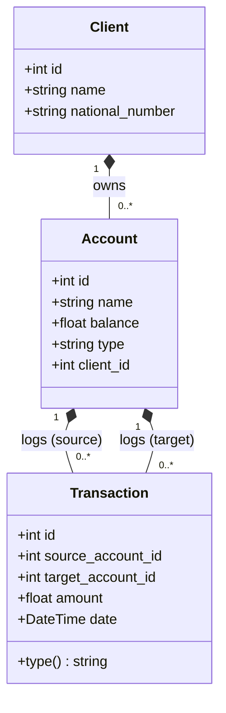
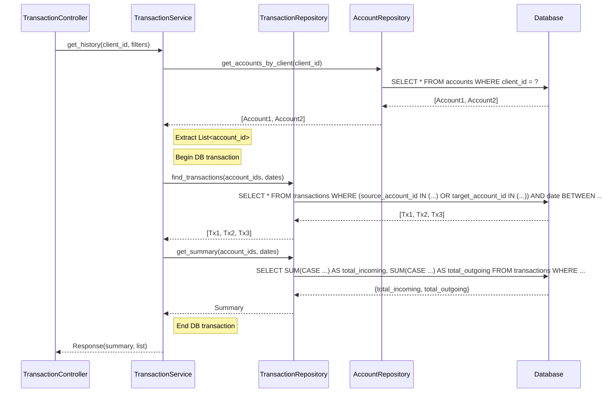
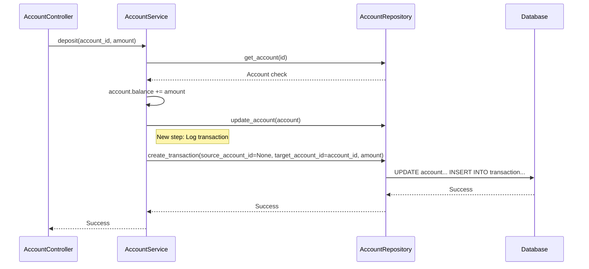

# Analysis for Developers: Transaction History

## Technical Overview
The goal is to implement a history mechanism for financial operations (deposits, withdrawals) for a client's accounts. Since currently no transaction log exists, we must introduce a new entity and update the existing services to persist this data.

## Database Schema Changes

### New Model: `Transaction`
We need a new table/model called `Transaction`.

| Field Name          | Type               | Description                                                      |
| :---                | :---               | :---                                                             |
| `id`                | `Integer` (PK)     | Unique identifier                                                |
| `source_account_id` | `Integer` (FK)     | Foreign Key to `Account.id`. NULL for deposits (money comes in). |
| `target_account_id` | `Integer` (FK)     | Foreign Key to `Account.id`. NULL for withdrawals (money goes out). |
| `amount`            | `Float/Integer`    | The amount involved                                              |
| `date`              | `DateTime`         | Timestamp of the operation                                       |
| `created_at`        | `DateTime`         | Audit timestamp                                                  |

**Derived transaction type** (not stored, inferred from account ID presence):
- Both `source_account_id` and `target_account_id` set → **TRANSFER**
- Only `source_account_id` set → **WITHDRAWAL**
- Only `target_account_id` set → **DEPOSIT**
- Neither set → **Invalid** (must be prevented by a DB constraint)

### Existing Models
- **Account**: No structural changes, but logic must be updated to create a `Transaction` whenever balance changes (except perhaps initial creation).

## API Specifications

### Endpoint: GET `/clients/{client_id}/transactions`

**Parameters:**
*   `client_id` (path): ID of the client.
*   `from_date` (query, optional): timestamp.
*   `to_date` (query, optional): timestamp.
*   `account_id` (query, optional): Filter by specific account ID belonging to the client.

**Response Body:**
```typescript
interface TransactionResponse {
    summary: {
        total_incoming: number; // Sum of DEPOSITS
        total_outgoing: number; // Sum of WITHDRAWALS
    };
    transactions: Array<{
        id: number;
        source_account_id: number | null;
        target_account_id: number | null;
        amount: number;
        type: string; // Derived: DEPOSIT | WITHDRAWAL | TRANSFER
        date: string;
    }>;
}
```

## Service Layer Logic

1.  **Transaction Creation**:
    - Modify `AccountService` methods `deposit` and `withdraw`.
    - After updating the account balance, create a new `Transaction` record using the same database session (atomic operation).

2.  **Transaction Retrieval**:
    - Create a new method `get_client_transactions(client_id, filters...)` in a new `TransactionService`.
    - Retrieve all accounts for the given `client_id` first.
    - Query `Transaction` table filtering by `source_account_id` or `target_account_id` matching the client's account IDs.
    - Apply date ranges if provided.
    - Compute the summary (total incoming / total outgoing) on the database side using an aggregate query (e.g., `SUM` with `CASE`/`FILTER`), issued as a separate query.
    - Both the transaction list query and the summary aggregation query must run inside the same DB transaction to guarantee they operate on a consistent dataset.

## UML Diagrams

### Class Diagram (Data Structure)



### Sequence Diagram (Data Flow)

**Scenario 1: Viewing History with filters**



**Scenario 2: Creating a Transaction (Deposit)**


